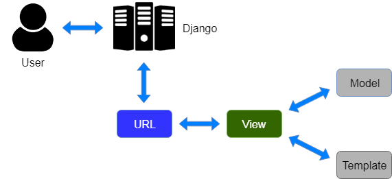

# Sumit-Intern

# Date 22-June-2022


## FIRST HALF
- ✅ Django Architecture MVT-Hands-on
```
What i concluded is
When the server receives any request by your browser, it looks for
the URL in request and then tries to map that URL with the list of
URLs present in the 👉 urls.py file of your project. When the
requested URL is matched with any of the URLs present in the list,
the corresponding views function is called from the 👉 views.py file.
This function in the  👉 views.py file will be performing all the
operations and then will return an HTML template from Templates
as a response to the request received from the browser.
And 👉 models.py helps to handle database. It is a data access layer which handles the data.
```


- ✅ ORM-Object Relational Mapping Hands-on
    - Models

```
class Book_info(models.Model):
    book_name = models.CharField(max_length=150, null=False)
    ISBN = models.CharField(max_length=150, null=False)
    author = models.CharField(max_length=50, null=False)
    category = models.CharField(max_length=700, null=True)
    price = models.IntegerField(null=True)
    edition = models.CharField(max_length=150, null=True)
    publisher = models.CharField(max_length=150, null=True)
    publishers = models.CharField(max_length=159, null=False)

```

## VIDEOS 
- NONE

## LINKS 
- ✅ [API-Guide](https://www.django-rest-framework.org/tutorial/quickstart/)

## SECOND HALF
- ✅ Reading deep about Views
```
My conclusion
The views are the controllers in Django’s MVT architecture. 
all logic are implemented and all the processing are
done

```
- ✅ Scene Behind 404 error
```
If no path function calls matches
with the URL in request, then the inbuilt 404 error (page not
found) template is rendered by Django.


```

## VIDEOS 
- None

## ASSIGNMENT
- No major update on Assignment

## DOUBTS
- Nothing as of now

## LINKS 
- ✅ [DRF-Quickstart Guide](https://www.django-rest-framework.org/tutorial/quickstart/#quickstart)
- ✅ [Request_Responses](https://www.django-rest-framework.org/tutorial/2-requests-and-responses/)
