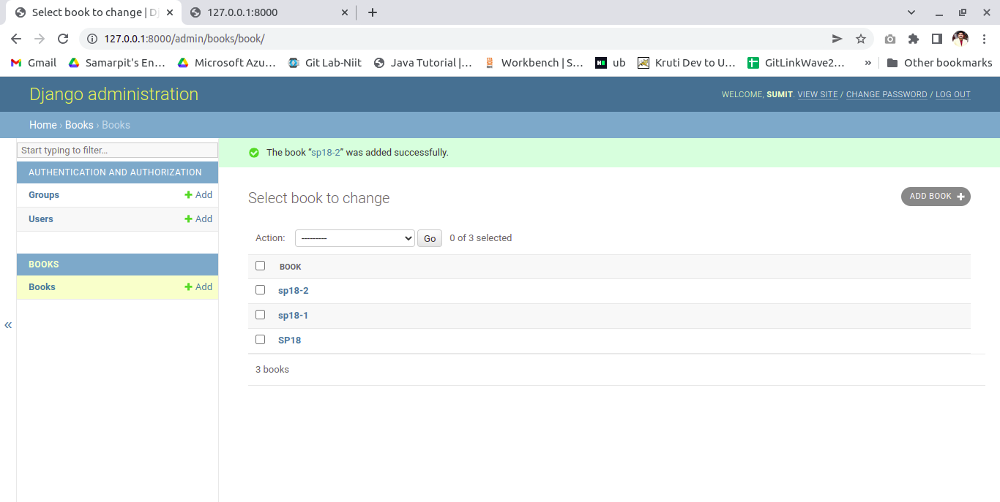
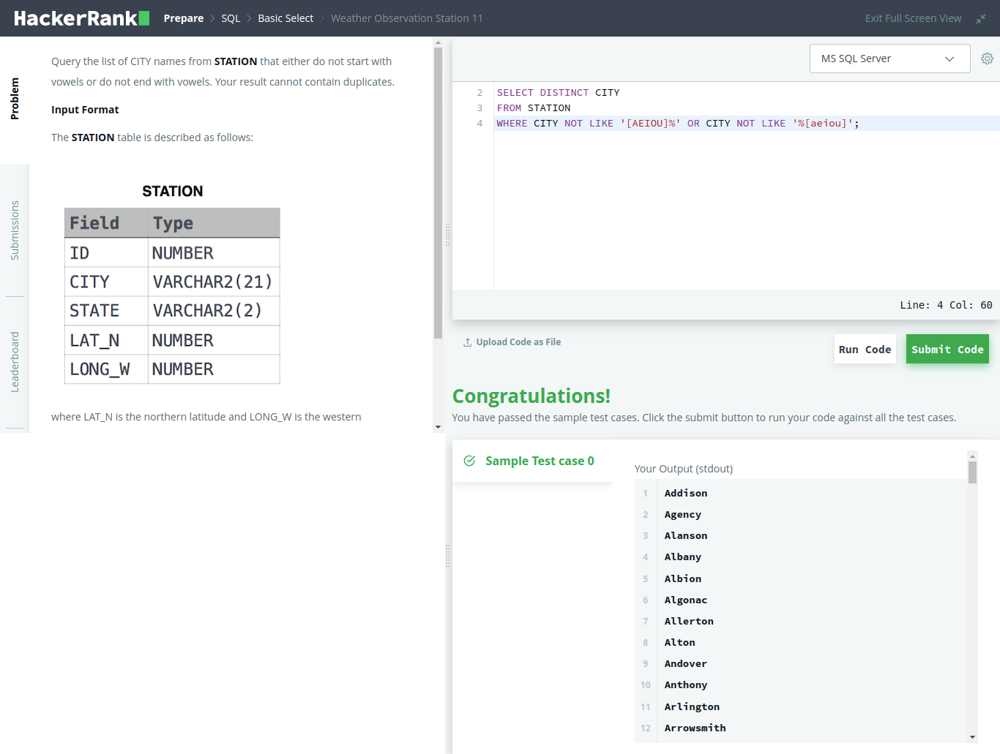

# Sumit-Intern

# Date 23-June-2022


## FIRST HALF
- ✅ Hands-on Django [refer to folder](https://github.com/sp18-interns/Sumit-Intern/tree/main/24-June-2022/Django_project)

```
Project created about library 
project will add and delete books and replicate to html page

```



## VIDEOS 
- NONE

## LINKS 
- ✅ [API-Guide](https://www.django-rest-framework.org/tutorial/quickstart/)


## SECOND HALF
- ✅ Serializer
- SQL-Hacker_Rank
- 


## VIDEOS 
- None

## ASSIGNMENT
- No major update on Assignment

## DOUBTS
- Nothing as of now

## LINKS 
- ✅ [DRF-Quickstart Guide](https://www.django-rest-framework.org/tutorial/quickstart/#quickstart)
- ✅ [Django Doc](https://docs.djangoproject.com/en/4.0/topics/db/models/)
- ✅ [Serializer](https://www.django-rest-framework.org/tutorial/1-serialization/)