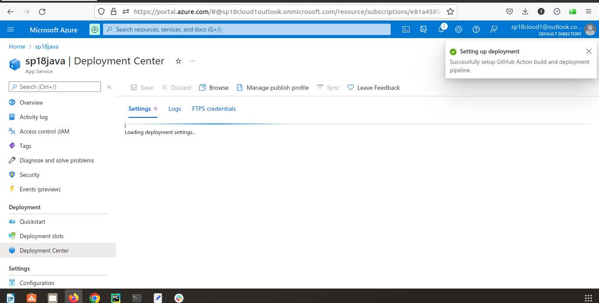
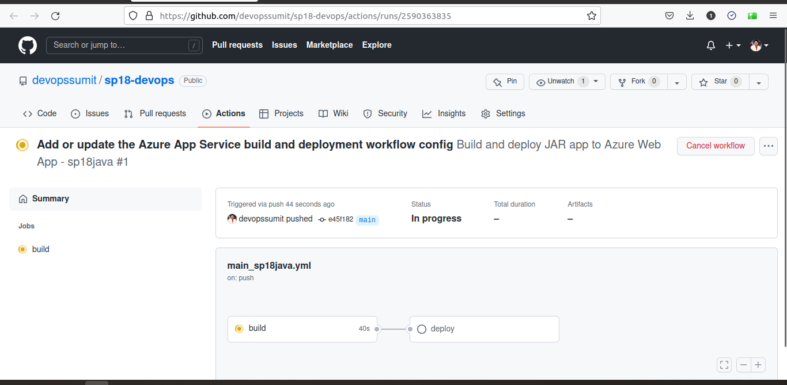
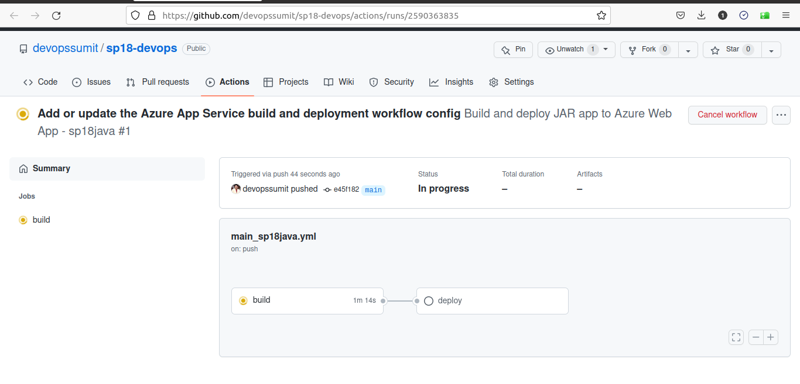
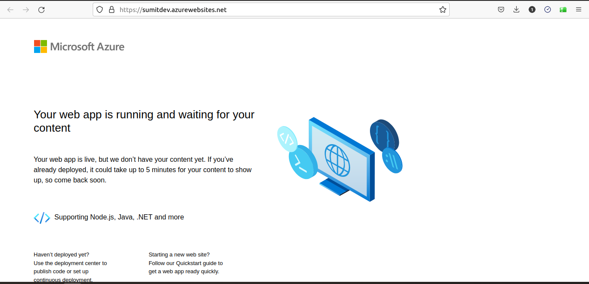

# Sumit-Intern

# Date 30-June-2022


## FIRST HALF
# Serializers
## Getting started UNKNOWNS
- `manage.py` options and purpose
- `django-admin` command
- `INSTALLED_APPS` significance, location, how/where/when to use
- `apps.py` configuration file for the app itself
- `migrations` directory stores migrations files for database changes
- `models.py` is where we define our database models
- `tests.py`is for our app-specific tests
- `views.py`is where we handle the request/response logic for our web app
- `wsgi.py`
- `asgi.py`
- `urls.py` contain a mapping of URLs and the corresponding action to be taken when that URL is hit.
- `Settings.py` conf & setting of project
- `createsuperuser`
- `Router`
- `Pagination`
- `API`
- `Serializer`
- `Request object`
- `request.POST`   Only handles form data.  Only works for 'POST' method. 
- `request.data`   Handles arbitrary data.  Works for 'POST', 'PUT' and 'PATCH' methods.
  - `Status codes` explicit identifiers coupled with numeric value which is return
```
Django REST framework

Part-2

A serializer translates data into a format that is easy to consume over the internet,
typically JSON, and is displayed at an API endpoint.


```

## SECOND HALF

# Devops Hands-on







## LINKS 
- ✅ [DRF-Quickstart Guide](https://www.django-rest-framework.org/tutorial/quickstart/#quickstart)
- ✅ [Django Doc](https://docs.djangoproject.com/en/4.0/topics/db/models/)
- ✅ [Serializer](https://www.django-rest-framework.org/tutorial/1-serialization/)
