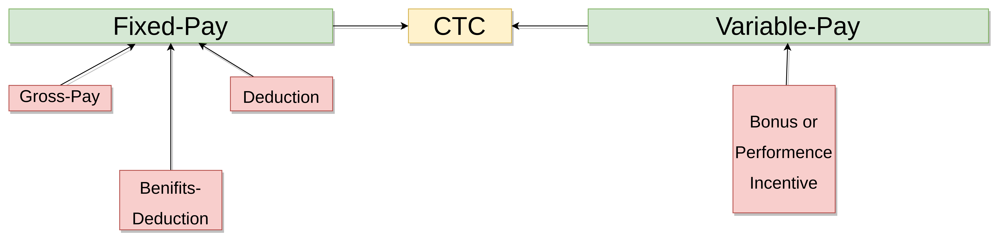

# Sumit-Intern

# Date 28-May-2022


## FIRST HALF

- ✅ [SQL-query Documentation](https://github.com/sp18-interns/Sumit-Intern/blob/main/28-May-2022/Hacker_Rank/SQL.md)
- ✅ Salary Calculator Assignment is started with new Approach 


## VIDEOS
- ✅
- 🚫


## ASSIGNMENT 
- ✅ Integrate Salary Calculator with Unit test no main file


## DOUBTS
- 🚧 Data Integrity in sql ? little confusing
```

Data Integrity is the assurance of accuracy and consistency of data over its entire life-cycle and is a critical
aspect of the design, implementation, and usage of any system which stores, processes,
or retrieves data. It also defines integrity constraints to enforce business rules on the data 
when it is entered into an application or a database.

```


## LINKS
- ✅ [Interactive_sql](https://sqlbolt.com/)


## SECOND HALF 
- ✅ Unit Testing  


- ✅ [Hacker Rank](https://github.com/sp18-interns/Sumit-Intern/tree/main/28-May-2022/Hacker_Rank)

## VIDEOS
- 🚫


## ASSIGNMENT
- 🚫

## DOUBTS
- 🚫

## LINKS

- 🚧 [Unit Testing](https://www.javatpoint.com/python-unit-testing)


